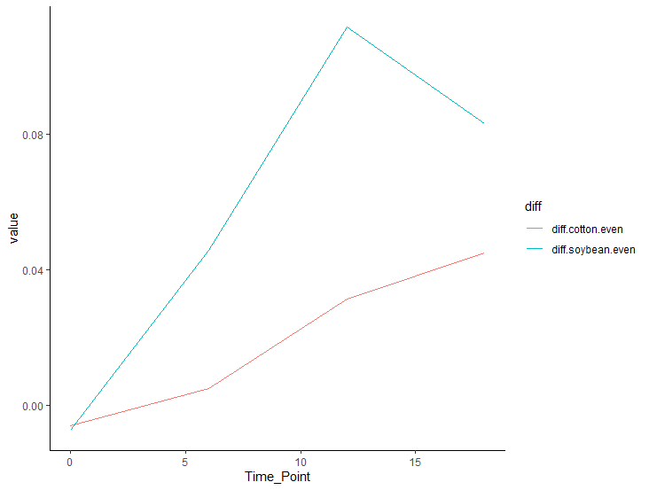

[Link to my Github](https://github.com/Logz1n/Reproducibility_Class)

# Loading libraries and color pallettes

``` r
#Loading Libraries
library(ggplot2) 
library(knitr)
library(readr)
library(ggpubr)
library(dplyr)
```

    ## 
    ## Attaching package: 'dplyr'

    ## The following objects are masked from 'package:stats':
    ## 
    ##     filter, lag

    ## The following objects are masked from 'package:base':
    ## 
    ##     intersect, setdiff, setequal, union

``` r
library(tidyverse)
```

    ## ── Attaching core tidyverse packages ──────────────────────── tidyverse 2.0.0 ──
    ## ✔ forcats   1.0.0     ✔ stringr   1.5.1
    ## ✔ lubridate 1.9.3     ✔ tibble    3.2.1
    ## ✔ purrr     1.0.2     ✔ tidyr     1.3.1

    ## ── Conflicts ────────────────────────────────────────── tidyverse_conflicts() ──
    ## ✖ dplyr::filter() masks stats::filter()
    ## ✖ dplyr::lag()    masks stats::lag()
    ## ℹ Use the conflicted package (<http://conflicted.r-lib.org/>) to force all conflicts to become errors

``` r
library(markdown)

#Colorblind pallette
cbbPalette <- c("#56B4E9", "#009E73", "#F0E442",
"#000000", "#D55E00", "#CC79A7", "#E69F00","#0072B2" ) #loading a color pallette
```

# Reading in Data

``` r
Diversity <- read.csv("DiversityData.csv", na = "na" ) #loading in the data so that R understands na is na so the column is numeric

Metadata <- read.csv("Metadata.csv", na = "na" ) #loading in the data so that R understands na is na so the column is numeric
```

# Joining Data Frames Together

``` r
alpha <- left_join(Metadata, Diversity, by = "Code")  # Join Metadata and Diversity data frames based on the "Code" column
```

# Calculating Pielou’s evenness index

``` r
alpha_even <- alpha %>%
  mutate(logRich = log(richness)) %>%  # Add a column for the logarithm of richness
  mutate(even = (shannon/logRich))  # Add a column for evenness as the ratio of Shannon diversity to log richness
```

# Calculating mean and standard error

``` r
alpha_average <- alpha_even %>%
  group_by(Crop, Time_Point) %>%  # Group data by Crop and Time_Point
  summarise(Mean.even = mean(even),  # Calculate the mean of evenness
            n = n(),  # Count the number of observations
            sd.dev = sd(even)) %>%  # Calculate the standard deviation of evenness
  mutate(std.err = sd.dev/sqrt(n))  # Calculate the standard error
```

    ## `summarise()` has grouped output by 'Crop'. You can override using the
    ## `.groups` argument.

# Calculating difference of evenness in crops

``` r
alpha_average2 <- alpha_average %>%
  select(Time_Point, Crop, Mean.even) %>%  # Select relevant columns
  pivot_wider(names_from = Crop, values_from = Mean.even) %>%  # Pivot data to have Crop names as columns
  mutate(diff.cotton.even = Soil - Cotton) %>%  # Calculate difference in evenness between Soil and Cotton
  mutate(diff.soybean.even = Soil - Soybean)  # Calculate difference in evenness between Soil and Soybean
```

# Plotting

``` r
Plot <- alpha_average2 %>%
  select(Time_Point, diff.cotton.even, diff.soybean.even) %>%  # Select relevant columns for plotting
  pivot_longer(c(diff.cotton.even, diff.soybean.even), names_to = "diff") %>%  # Pivot data to long format for plotting
  ggplot(aes(x = Time_Point, y = value, color = diff)) +  # Create a ggplot with Time_Point on x-axis and value on y-axis, colored by diff
  geom_line() +  # Add line geometry to the plot
  theme_classic()  # Apply classic theme to the plot
```

<figure>

<figcaption aria-hidden="true">Image</figcaption>
</figure>
